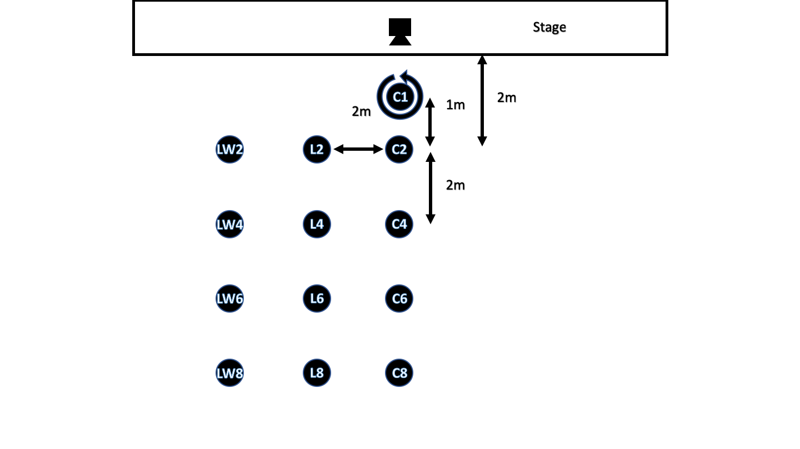

# 360 Degree Binaural Room Impulse Response - FOA Impulse Response Database
by Applied Psychoacoustics Lab, University of Huddersfield

Authors: Bogdan Bacila and Hyunkook Lee
bogdan.bacila@hud.ac.uk, h.lee@hud.ac.uk

## Description
An open-access database for 360° binaural room impulse responses (BRIR) captured in a reverberant concert hall. Head-rotated BRIRs were acquired with 3.6° angular resolution for each of 13 different receiver positions, using a custom-made head-rotation system that was automated and integrated with the Huddersfield Acoustical Analysis Research Toolbox. The BRIRs are provided in the SOFA format. The library also contains impulse responses captured using a first-order Ambisonic microphone and an omnidirectional microphone. It is expected that the database would be useful for studying the perception of spatial attributes in a six degrees-of-freedom context.

## Folder Structure
The impulse responses are organised into two main folders:
* Binaural: Contains the SOFA files and MATLAB files for each position, recorded with the Neumann KU100 binaural head.
* FOA: Contains the First Order Ambisonics audio files in A format and B format for each individual position, recorded with an Sennheiser Ambeo microphone in an end-fire configuration.  

## Naming Convention
The files are named after their relative position on the stage and the distance from the stage:
* C = Centre
* L = Left
* LW = Left Wide

## Publication
This database was presented at the Audio Engineering Society 146th International Convention.
Download link: http://www.aes.org/e-lib/browse.cfm?elib=20371
